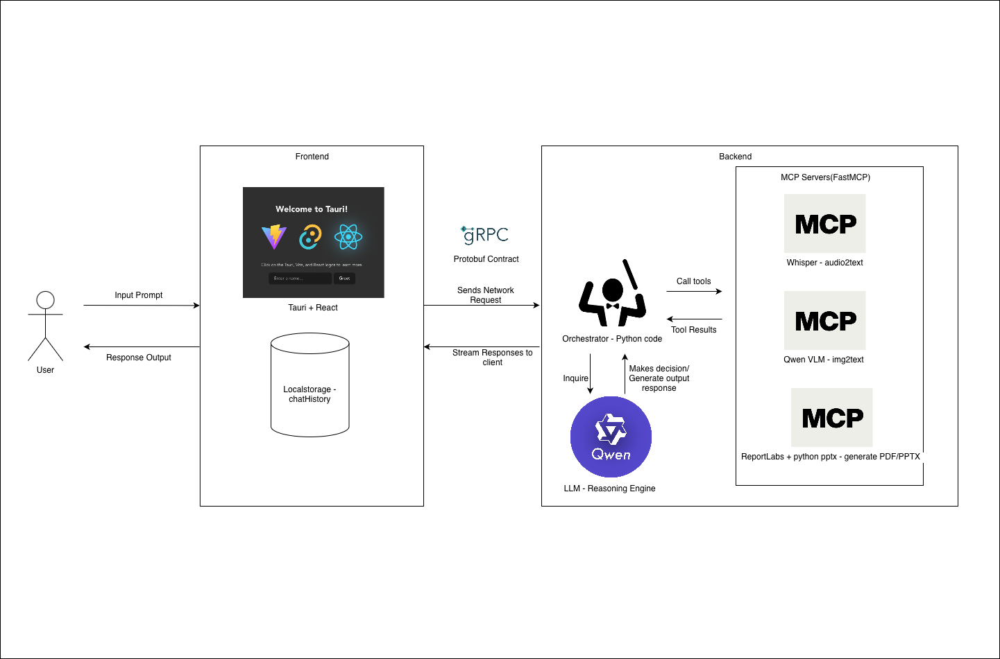
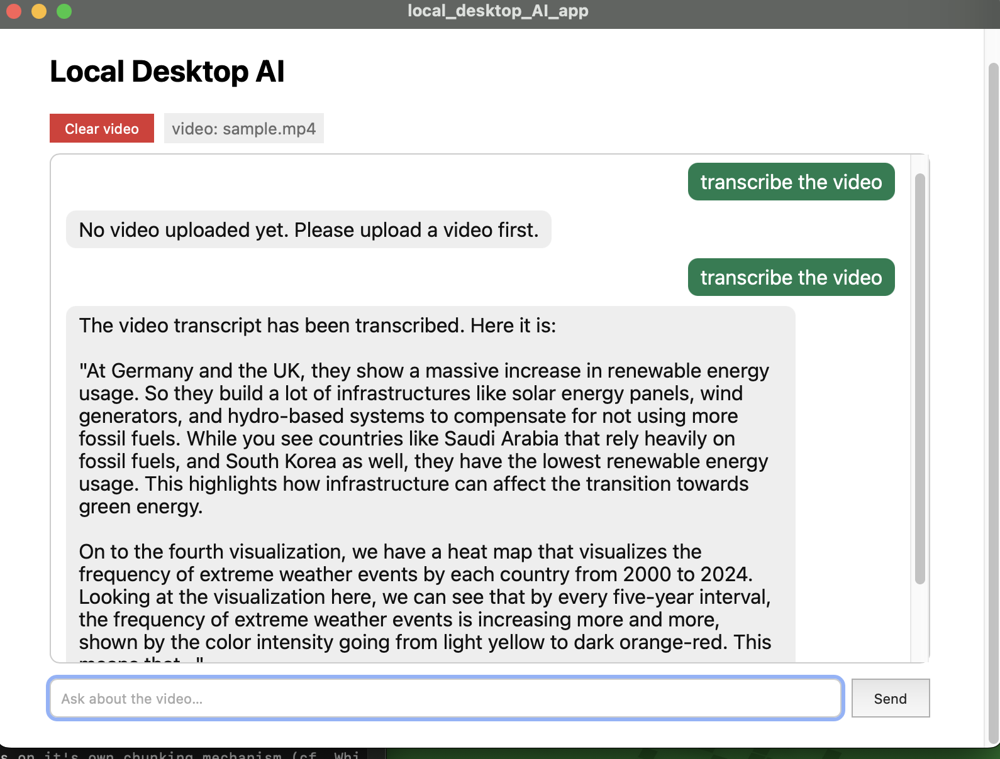
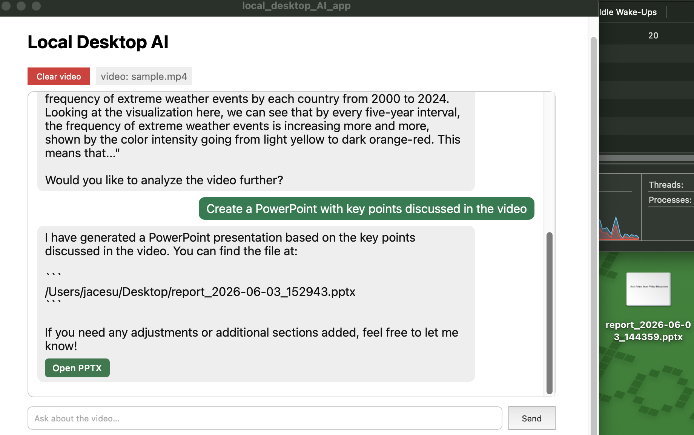
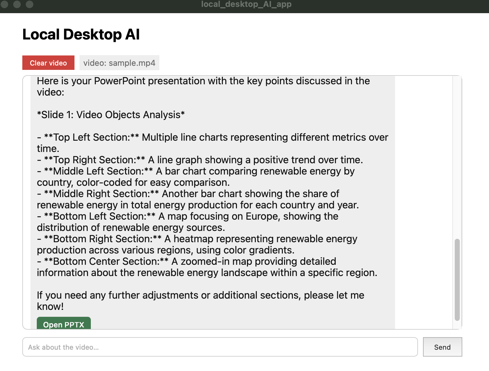
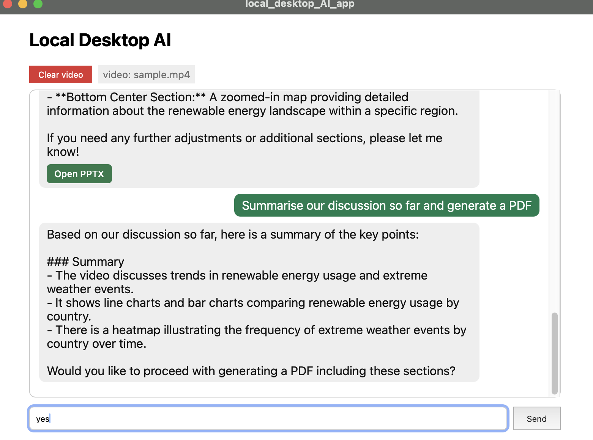
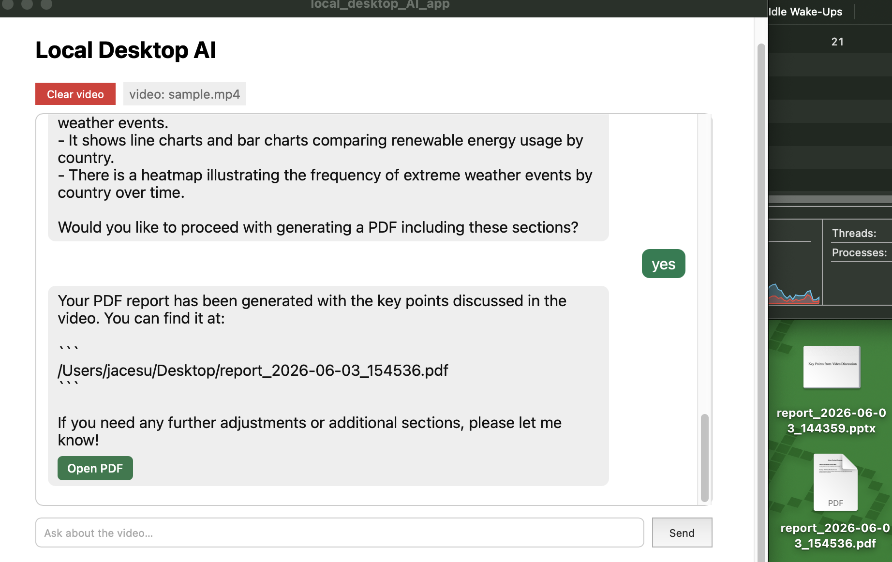

  
## Table of Contents

* [Local Desktop AI](#local-desktop-ai)
* [Architecture](#architecture)
* [Key Features](#key-features)
* [Prerequisites](#prerequisites)
* [Setup](#setup)
* [Running](#running)
* [Project Structure](#project-structure)
* [Examples](#examples)
* [Summary](#summary)

## Local Desktop AI

A fully local and offline desktop application for analyzing and querying short video files. Select a video, then ask in natural language, the app transcribes speech, analyzes the visuals, and generates PDF/PowerPoint reports. Built with React + Tauri (frontend) talking to a Python backend over gRPC, where multiple agents communicate with MCP servers. Inference runs locally via Hugging Face Transformers (Others), OpenVINO (Intel), MLX(Apple Silicon).

## Architecture


  
## Key Features

-  **Select and analyze local video** - file upload .mp4 .mov .m4v .webm

-  **Natural-language interaction** - Qwen model

-  **Transcription** (Whisper) - speech to text

-  **Vision analysis** (Qwen2.5-VL) - objects, scenes, captioning, on-screen text, graphs/charts

-  **Generation** - PDF reports (ReportLab) and PowerPoint decks (python-pptx)

-  **Human-in-the-loop clarification** for ambiguous queries

-  **Persistent chat history** - survives app restarts (local storage)

-  **Local** - no cloud, no public MCP servers

-  **Trio-backend runtime** - OpenVINO on Intel hardware, HuggingFace Transformers(Others), and MLX on Apple Silicon

## Prerequisites

-  **Python 3.11**
  
-  **C++ build tools (Windows only)**

-  **Node.js 18+** and npm

-  **Rust toolchain** (`cargo`)

-  **ffmpeg**

-  Protobuf

-  **Disk space**: ~25 GB for default 3B models, ~50 GB for 7B


-  **RAM**: 16 GB minimum, 32 GB recommended for 7B models


## Setup

### 1. Backend (Python)
```bash
cd  backend
python3.11  -m  venv  venv
source  venv/bin/activate   # venv/scripts/activate (Windows)
pip  install  -r  requirements.txt
```

  

Install **ffmpeg** (Whisper needs it to read audio):
```bash
brew  install  ffmpeg  # macOS
# sudo apt install ffmpeg # Linux
# winget install gyan.FFmpeg # Windows
```

  

### 2. Download the local models
Place models under `backend/models/`.

**Others(CUDA/CPU)** 

```bash
cd  backend
pip install huggingface_hub #if !already
hf  download  Qwen/Qwen2.5-3B-Instruct  --local-dir  models/qwen2.5-3b-instruct
hf  download  Qwen/Qwen2.5-VL-3B-Instruct  --local-dir  models/qwen2.5-vl-3b
hf  download  openai/whisper-base  --local-dir  models/whisper-base
```
**Apple Silicon**
```bash
# 
cd backend
hf download mlx-community/Qwen2.5-3B-Instruct-4bit    --local-dir models/qwen2.5-3b-instruct-mlx-4bit
hf download mlx-community/Qwen2.5-VL-3B-Instruct-4bit --local-dir models/qwen2.5-vl-3b-mlx-4bit
hf download mlx-community/whisper-base-mlx-4bit       --local-dir models/whisper-base-mlx-4bit
```

**Intel hosts** use the OpenVINO runtime with int4/int8 models:
```bash
# If too slow switch to 3B version 
cd  backend

hf download OpenVINO/Qwen2.5-3B-Instruct-int4-ov --local-dir models/qwen2.5-7b-int4
hf download OpenVINO/Qwen2.5-VL-3B-Instruct-int4-ov --local-dir models/qwen2.5-vl-7b-int4
hf  download  OpenVINO/whisper-base-int8-ov  --local-dir  models/whisper-base-int8-ov
```

If the OpenVINO repos aren't available, convert from the base models yourself:
```bash
optimum-cli export openvino --model Qwen/Qwen2.5-3B-Instruct --weight-format int4 models/qwen2.5-3b-int4
optimum-cli export openvino --model Qwen/Qwen2.5-VL-3B-Instruct --weight-format int4 models/qwen2.5-vl-3b-int4
```

### 3. Frontend (React + Tauri)

```bash
# from the project root
npm  install
```

## Running

Open **two terminals**:

**Terminal 1 - backend** (starts the gRPC server + MCP servers):
```bash
cd  backend
source  venv/bin/activate  # venv/scripts/activate (Windows)
python  server.py
# → "gRPC server running on port 50051."
```

**Terminal 2 - desktop app:**
```bash
source  venv/bin/activate  # venv/scripts/activate (Windows)
npm  run  tauri  dev
```

Then in the app: click **Choose video**, pick a video, and start asking questions. Generated PDFs/PPTX open with the **Open** button and are saved to your **Desktop**.

  
  

## Project Structure
```
local_desktop_AI_app/
│
├── README.md
├── img/    # example query and response + architecture diagram
├── generated_output_reports/   # example output pdf and pptx generated
├── input_videos/   # sample videos used for queries
│
├── backend/ # Python AI backend
│   ├── requirements.txt # Python dependencies
│   ├── server.py # gRPC server entry point
│   ├── orchestrator.py # ReAct loop + system prompt
│   ├── llm.py # Qwen2.5 LLM
│   ├── mcp_client.py # MCP client; launches the MCP HTTP servers + connects over Streamable HTTP
│   ├── client.py # gRPC test client
│   ├── models/ # Downloaded model weights 
│   │
│   ├── proto/
│   │   └── agent.proto # gRPC contract (UploadVideo/SendQuery)
│   │
│   ├── agents/ # Domain-specific agent logic
│   │   ├── transcription_agent.py # Whisper audio→text
│   │   ├── vision_agent.py # Qwen2.5-VL frame→text
│   │   └── generation_agent.py # ReportLab/python-pptx file rendering
│   │
│   ├── MCP/ # FastMCP servers (Streamable HTTP, one local port each)
│   │   ├── __init__.py # shared HOST/PORTS config + server_url()
│   │   ├── transcription_server.py
│   │   ├── vision_server.py
│   │   └── generation_server.py
│   │
│   └── utils/
│       └── runtime.py # pick_backend() platform detection
│
├── src/ # React frontend
│   ├── App.jsx # Main chat UI component
│   ├── App.css
│   └── main.jsx # React entry point
│
└── src-tauri/ # Tauri (Rust)
    ├── src/ # lib.rs, main.rs
    ├── build.rs # tonic-build (compiles proto for Rust)
    └── tauri.conf.json # Tauri window/build config


```

## Examples
- **Transcribe the video**


- **Create a PowerPoint with key points discussed in the video**


- **What objects are shown in the video**


- **Summarise our discussion so far and generate a PDF**




## Summary

A summary of what works, what doesn't, the challenges encountered, and what could be improved with more time.

### What works
- **Agentic orchestration (ReAct loop)** - The orchestrator asks the LLM which tools to use,
  runs them, feeds results back, and chains multiple agents when a query needs it.

- **Human-in-the-loop clarification** - System Prompted to always clarify on ambiguous queries

- **End-to-end local pipeline.** - Select a video → natural-language query → the LLM routes
  to the right agent(s) → answer back in chat.

- **MCP servers** - Three FastMCP servers (transcription, vision, generation)
over Streamable HTTP on localhost, auto-spawned at startup when orchestrator calls`list_all_tools` via MCP client.

- **gRPC - Tauri bridge** - React `invoke()` → Rust `tonic` client → Backend gRPC server,
  responses streamed back.

- **Tool-schema discovery** - orchestrator dynamically discovers tool schemas from MCP servers via `list_all_tools` at startup via MCP client.

-  **Transcription** (Whisper) - speech-to-text.

-  **Vision analysis** (Qwen2.5-VL) - VLM answers object recognition, scene captioning, on-screen text, and graph description by varying the query.

-  **Generation** - Generates PDF (ReportLab) and PPTX (python-pptx)

-  **Persistent chat history** - stored in `localStorage`, survives app restarts.

-  **Trio-backend runtime** - Supports Hugging Face/MPS (Others), OpenVINO int4 (Intel), and MLX (Apple Silicon)
  

### What doesn't work well 

Almost all problems encountered during testing are due to **the local LLM being a 3B model, which follows complex instructions only probabilistically.**

-  **Tool-routing reliability** - The model sometimes over-calls tools (e.g. trying to generate a PDF when only a transcript was asked) or under-calls them (calling only one tool for a "summarize the whole video" request). 

-  **"Summarize the conversation" vs "summarize the video"** - Because the verbatim transcript is within the chat history context, the model tends to summarize the video content instead of the conversation as a whole, and occasionally re-asks a clarification it was already answered.

-  **Malformed tool-call arguments** - The LLM sometimes produces invalid JSON, wrong argument keys(`content` instead of `body`), or a list instead of an object. Mitigated by (JSON repair, key-tolerant parsing, error handling), but unreliability remains; may also be mitigated with a larger model.

-  **Vision accuracy** - The VLM occasionally mislabels objects/graphs, because frames are downscaled and only a few are sampled to fit memory. Additionally longer videos means sparser visual coverage due to budget fixed frame sampling; currently set at 6 frames which is fine for 1 minute videos.

-  **Performance** - Local MCP server stay open at startup but each MCP client request still need to establish a fresh client connection each time the tool is called, which can add up when chaining tool calls. 

-  **Backend session memory** - `localStorage` persists chat history only for display; app restart will wipe backend memory clean. 

### Challenges encountered

-  **Bridging synchronous gRPC with asynchronous MCP** - MCP's client API is `async`; gRPC handlers are sync. Each tool call is wrapped in `asyncio.run()` to bridge the two.

-  **Cross-platform MCP transport** - Initially used stdio transport spawned a subprocess per call, and transporting subprocess through asyncio uses a different event loop on Windows. Switched the MCP servers to streamable HTTP over localhost, so the client talks over sockets (no more subprocess in asyncio loop).

- **Small-model unpredictability** - The bulk of the effort went into making an unreliable model behave consistently - through prompt scaffolding and code-level guardrails.

-  **Requiremnt constraint** - My computer uses Apple M2 chip which does not run well with OpenVINO, and the test requirement states that "All AI inference must run locally, using OpenVINO-optimized or Hugging Face
models". Using Metal's MPS device mitigates this constartint but still somewhat slow.


### Potential improvements with more time

- **Fine-tuning the LLM (LoRA)** - Train the LLM on a dataset of (`query` → `expected tool call`) examples so tool-routing reliability improves. Additionally training on specified queries related to video content extraction and PDF and PPTX generation will also remove the bulk of decision rules from `SYSTEM_PROMPT`.

- **Constrained structure decoding** - (e.g. `outlines` library) to prevent invalid schema tool-call JSON, eliminating the problem with malformed argument failures.

-  **Separate generated artifacts / video extracted content from chat history** - Fixes the "summarize the conversation vs the video" confusion. 

- **Backend memory (SQLite)** - So the LLM's conversation context survives a server restart, not just the on-screen display.

- **Confidence-gated human in the loop** - trigger clarification on measured low-confidence routing and resume the suspended task, rather than relying on the model to ask.

- **Speed** - reuse the KV-cache across turns not just within a single prompt.

- **Persistent MCP sessions** - Currently the MCP servers stay open at start up, but each tool call still opens and tears down a fresh session. A background-thread `asyncio` loop holding one session per server open across calls would remove reduce the overhead.

- **Bonus** - a C# launcher driving a PyInstaller packaged backend.

- **Evals** - Correctness is currently judged manually. Making test case to check tool-routing accuracy will define a measurable metric for improving design and prompt scaffolding.

- **Add more layers of context engineering** - Compaction, so long sessions don't grow unbounded and inflate token cost per call.
